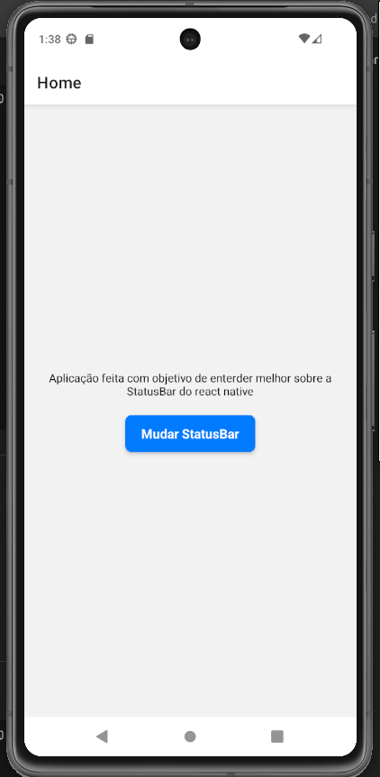
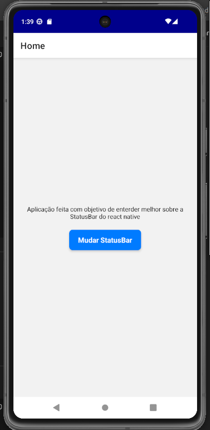

# React Native - StatusBar

Este projeto foi desenvolvido como atividade da faculdade com o objetivo de **compreender o funcionamento e a personalização da StatusBar no React Native**, permitindo alterar dinamicamente o estilo e a cor da barra de status do dispositivo.

---

## Funcionalidades
- Alterna entre **`light-content`** e **`dark-content`**
- Muda a **cor de fundo da StatusBar**
- Utiliza **TouchableOpacity** para interação com o usuário
- Exemplo prático de manipulação da interface nativa

---

## Telas do Aplicativo



## Como executar 

1. **Clone o repositório:**

```bash
git clone https://github.com/lauanderson-rael/rn-statusbar
cd rn-shopping-list
```

2. **Instale as dependências:**

```bash
npm install
```

3. **Inicie o projeto:**

```bash
npx expo start
```

4. **Execute no dispositivo:**
   - Baixe o app **Expo Go** na Play Store/App Store
   - Escaneie o QR Code que aparece no terminal
   - Ou pressione `a` para Android ou `i` para iOS (se tiver simulador)

## Tecnologias Utilizadas
- **React Native**
- **Expo**
- **TypeScript (Hooks: useState)**
